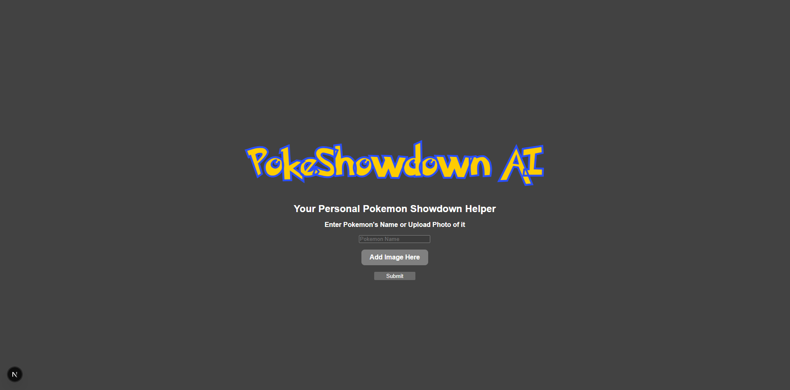
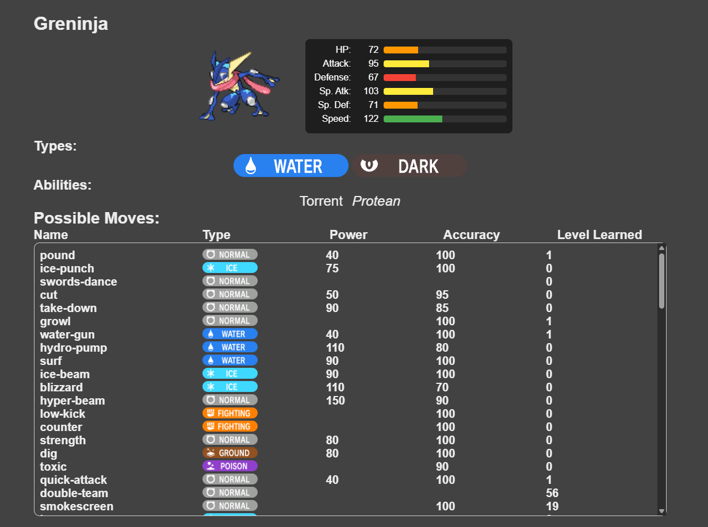
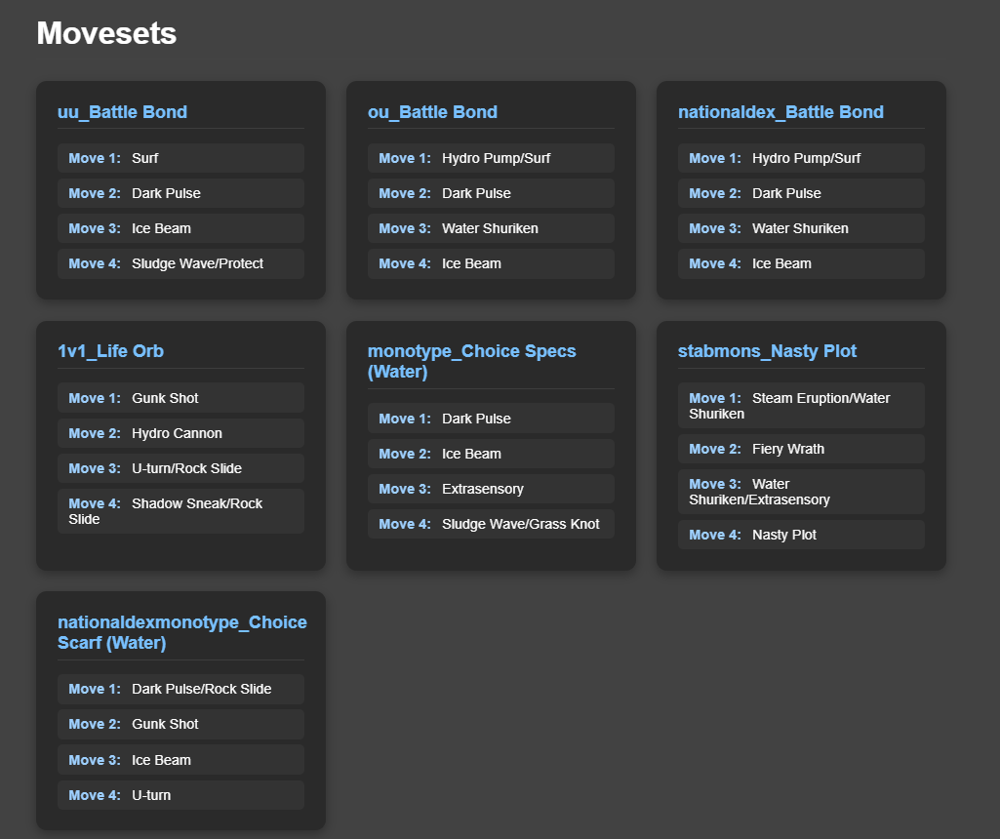

# PokeShowdown AI

A modern web application that helps Pokémon trainers analyze and understand their Pokémon's stats, abilities, moves, and competitive potential using AI-powered image recognition and comprehensive Pokémon data.

## What This Project Does

PokeShowdown AI is your personal Pokémon Showdown helper that combines the power of artificial intelligence with comprehensive Pokémon data to provide detailed analysis and insights. The application allows users to:

- **Input Pokémon by Name or Image**: Enter a Pokémon's name directly or upload an image for AI-powered identification
- **AI-Powered Image Recognition**: Uses Google's Gemini AI to identify Pokémon from uploaded images with high accuracy
- **Comprehensive Pokémon Analysis**: Displays detailed information including:
  - Base stats with visual stat bars
  - Pokémon types with type icons
  - Abilities (including hidden abilities)
  - Complete move lists with power, accuracy, and learn levels
  - Competitive moveset suggestions
- **Real-time Data**: Fetches live data from the official PokéAPI and SmogonAPI for the most up-to-date information

The application is built with a modern tech stack featuring a Next.js frontend and Flask backend, providing a smooth, responsive user experience for Pokémon trainers of all levels.

## Libraries and APIs Used

This project leverages a modern tech stack combining frontend and backend technologies with AI capabilities and external data sources. The frontend is built with **Next.js 14** and **React** for creating an interactive user interface with server-side rendering capabilities, styled with custom **CSS3** using responsive design principles and media queries. The backend utilizes **Flask** alongside **Flask-CORS** for cross-origin resource sharing and **Python Requests** for external API communication. 

AI functionality is powered by **Google Gemini AI**, enabling advanced image recognition for Pokémon identification from uploaded photos. Data is sourced from the comprehensive **PokéAPI** RESTful service and the **SmogonAPI**, which provides detailed Pokémon information including stats, moves, abilities, and type data.

## Screenshots

### Home Page

### Pokémon Analysis Page - Top Section with Stats

### Pokémon Analysis Page - Bottom Section with Movesets

